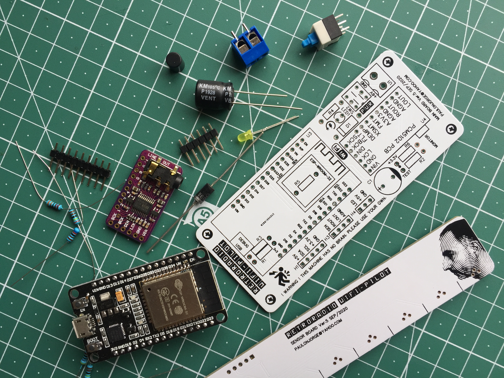
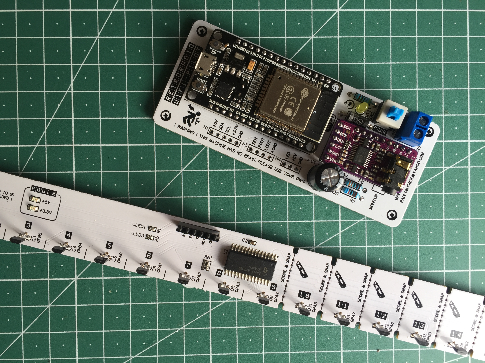

# RETRORADIO WIFI-PILOT

Clean upgrade of a 1970s radio receiver to include internet web radio, ambilight and hourly clock functions.

Demo videos on <a href="https://www.youtube.com/user/m1nuteman" target="_blank">YouTube.</a>

Build details at: https://www.hackster.io/pnjorge

--------------------------------

